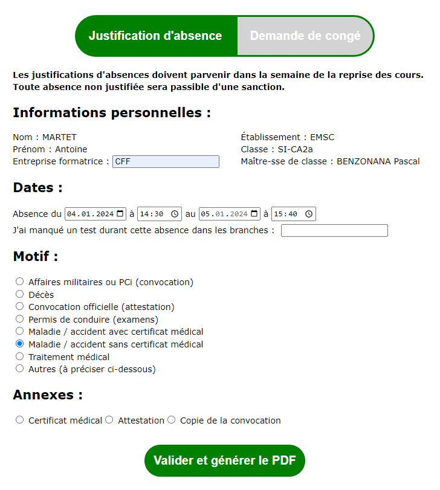
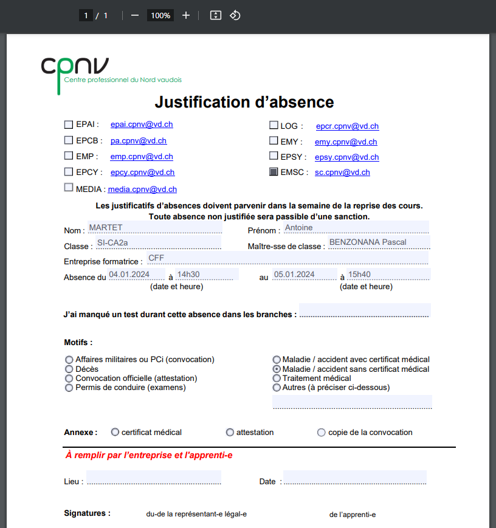
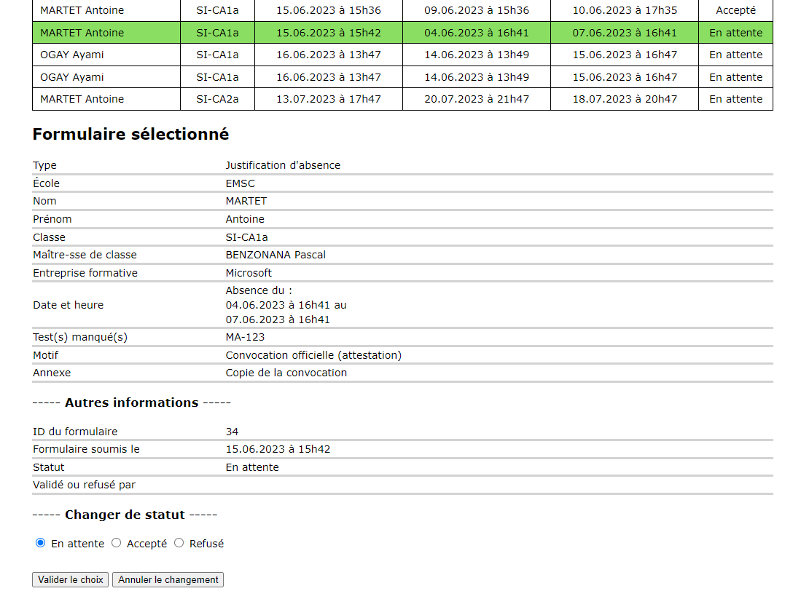

# Absences-CPNV
Absences CPNV est un projet de développement réalisé dans le cours Projet (Groupes) pour l'apprentissage du développement de projets en équipe. Ce projet est développé essentiellement en PHP et JavaScript et vise à réaliser un site web qui digitalise les demandes de congé et justificatifs d'absence des élèves du CPNV. Nous envisageons que le site puisse être une application de l’intranet du CPNV.

# Structure du site
Le site Web contient trois pages :

## Page de connexion
Une page permettant de rediriger vers des pages différentes selon que l'utilisateur est étudiant, enseignant ou doyen.
Cette page ne devrait exister que dans le cadre du développement car nous supposons qu’en situation réelle l'utilisateur est déjà connecté sur le site lorsque ce projet est inséré dans l’intranet.

## Page de remplissage du formulaire pour les étudiants
Une page permettant aux étudiants de remplir des formulaires.
Le formulaire comporte deux modèles, un pour les demandes de congé et un autre pour les justificatifs d'absence. Le passage de l’un à l’autre se fait à l'aide d'onglets.
Les informations soumises par l'étudiant sont envoyées à une base de données SQL et un fichier PDF contenant les informations saisies est créé et téléchargeable/imprimable instantanément. Nous supposons que les étudiants devront imprimer et soumettre le PDF pour les signatures nécessaires.

## Page de validation pour les enseignants
Une page permettant aux professeurs de valider les formulaires soumis.
Si le professeur connecté est un maître de classe, la page affichera tous les formulaires d'élèves pour sa classe.
Le doyen peut également consulter les formulaires de tous les étudiants de la filière informatique.

# Screenshots
## Formulaire étudiant

## PDF généré à partir du formulaire étudiant

## Vue côté prof, avec une justification d'absence sélectionnée

